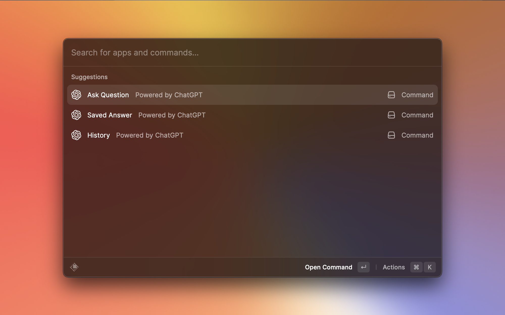
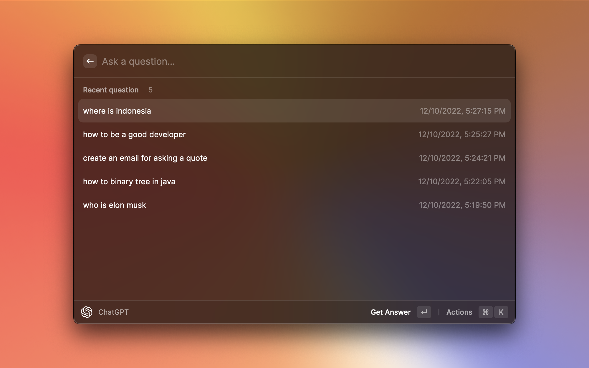
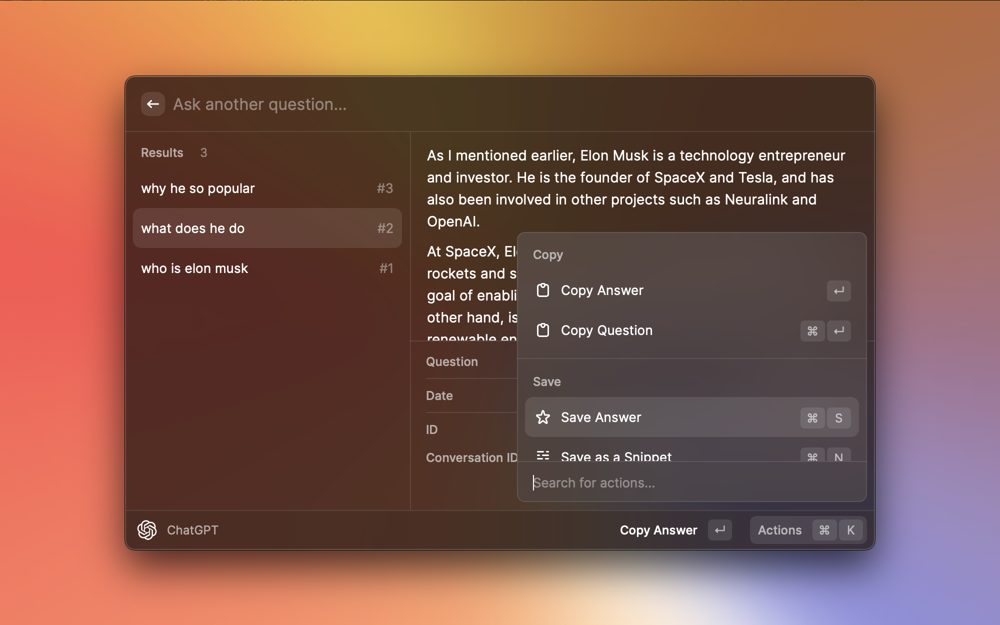
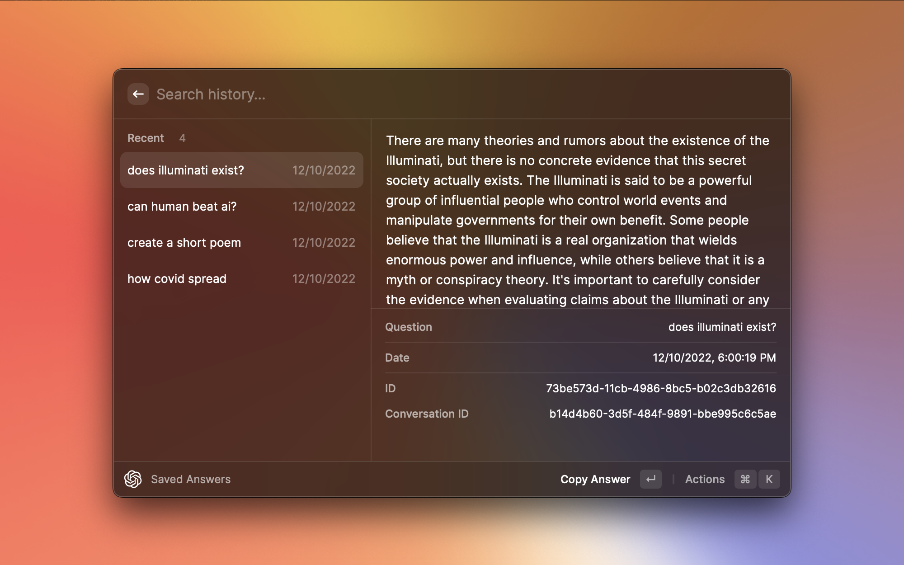
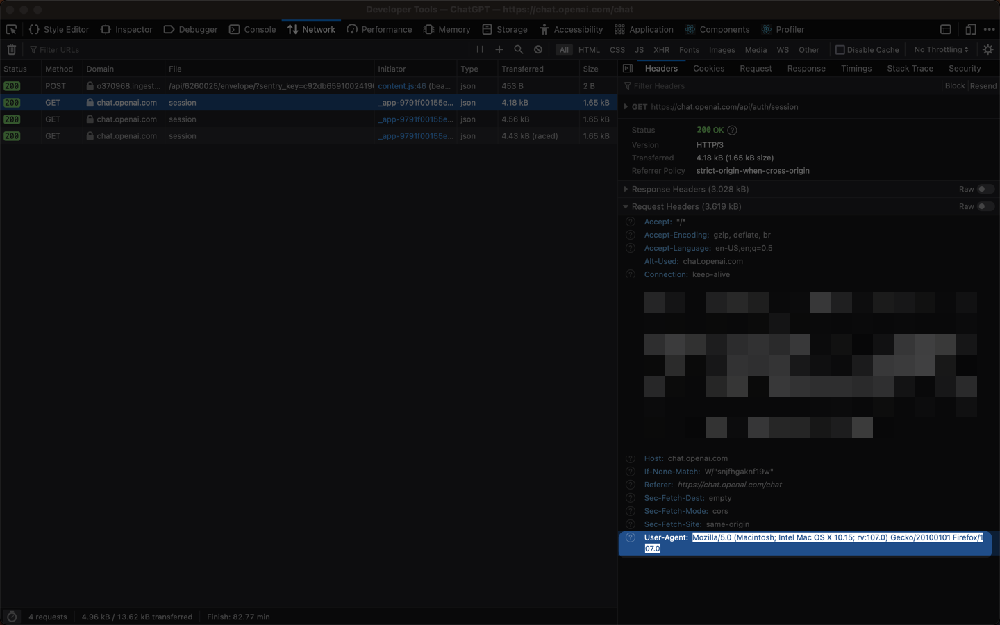
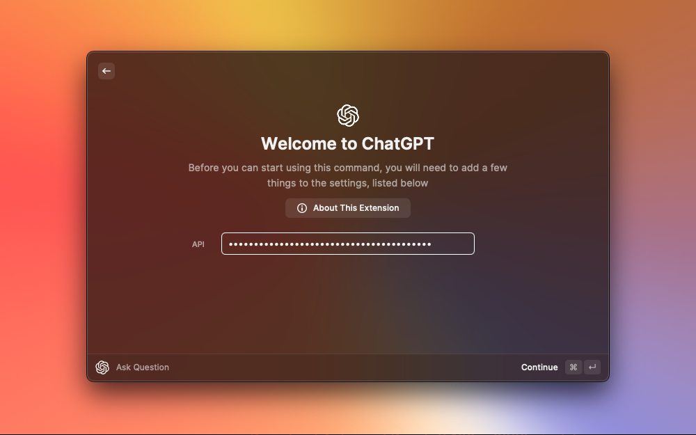

<h1 align="center">ChatGPT</h1>

<h3 align="center">
Interact with OpenAI's ChatGPT right from your command bar
</h3>

(Archived until there's an official API)

# Features

### Ask anything, from your favourite thing

Straight from your command bar, ask anything that you wanted and get ChatGPT's generated answer without opening any browser app.

### Well-designed, undistracted

Read through AI-generated answer in a clean and nice-looking markdown view without losing ongoing conversation.

### Save the answer, for later

Got the answer that you wanted? Great. Now you can save it in your collection locally and here you have it! No need to reask again.

### Look-up your past, fast

Automatically save all the asked questions and its generated answer locally, so you can go back digging for the answer you're looking for without any internet connection!

# How to use

This package requires a valid `Session Token` from ChatGPT to access it's unofficial REST API by [transitive-bullshit/chatgpt-api](https://github.com/transitive-bullshit/chatgpt-api).

To get a session token:

1. Go to https://chat.openai.com/chat and log in or sign up.
2. Open dev tools.
3. Open `Application` > `Cookies`.

   

4. Copy the value of `__Secure-next-auth.session-token` and paste it in the `Session Token` initialization set-up field!

### Update December 11, 2022

> An update note from [the API author](https://github.com/transitive-bullshit/chatgpt-api)

Today, OpenAI added additional Cloudflare protections that make it more difficult to access the unofficial API. Here's some additional steps that you need to follow:

5. Copy the value of the `cf_clearance` cookie and paste it in the `Clearance Token` initialization set-up field.

6. Copy your browser's `user-agent` header from any request in your browser's network tab and paste it in the `User Agent` initialization set-up field.

Restrictions on this method:

- Cloudflare `cf_clearance` **tokens expire after 2 hours**, so there will be a pop-up reminder to update your token if you had an invalid token value.
- Your `user-agent` and `IP address` **must match** from the real browser window you're logged in with to the one you're using for the extension.
  - This means that you currently can't log in with your laptop and then run the extension in the same time.
- You should not be using this account while the extension is already running, because that browser window may refresh one of your tokens and invalidate the extension's session.

# Initialization set-up

> All the preferences value will be stored locally using [Preferences API](https://developers.raycast.com/api-reference/preferences)

---

Made with ♥ from Indonesia

